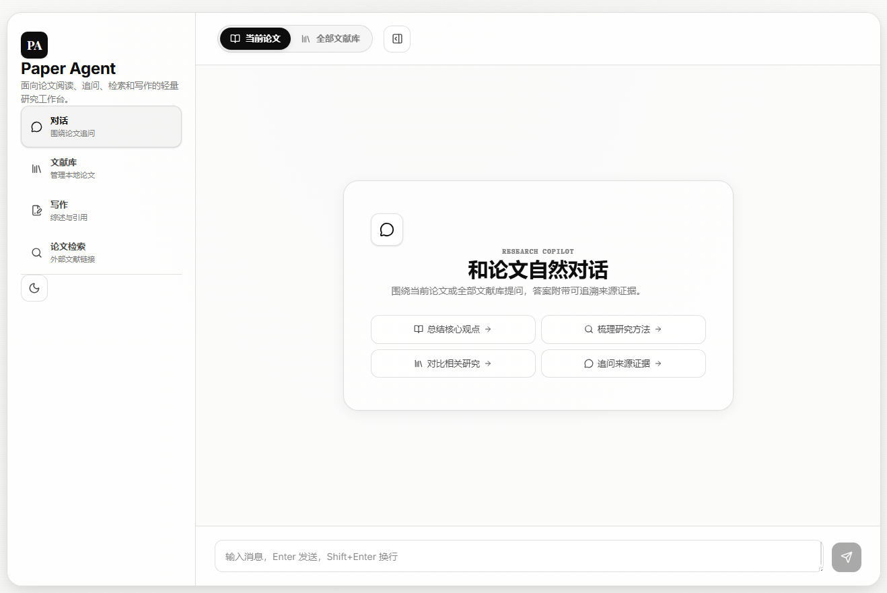
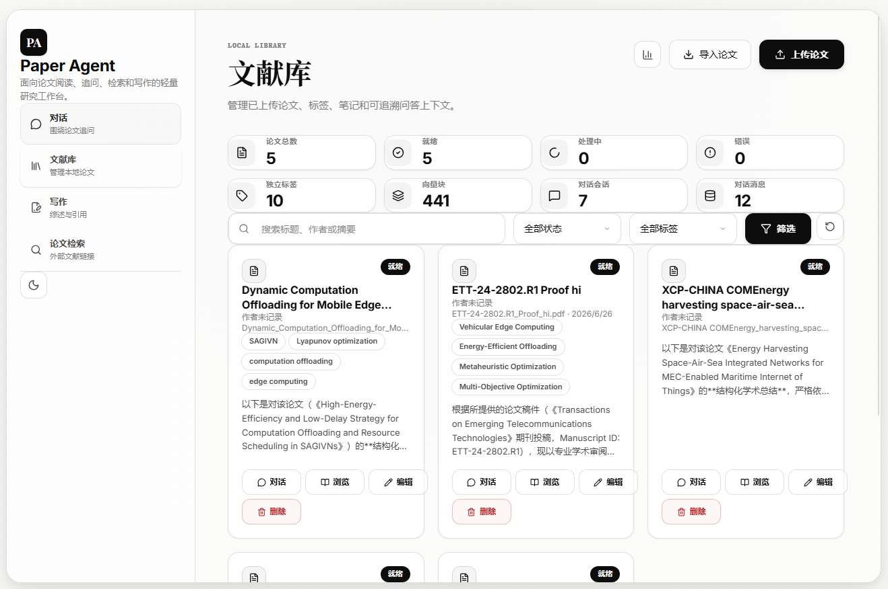

# Paper Agent

基于 Spring Boot + React + PostgreSQL/pgvector 的科研文献工具。支持 PDF 上传解析、文献库管理、RAG 问答、外部论文检索、综述写作和 Markdown/LaTeX 导出。

## 截图





## 功能

- **文献库**：上传 PDF，解析文本，管理标题、作者、DOI、标签、摘要和笔记。
- **处理状态追踪**：上传 → 解析 → 向量化 → 就绪，每个阶段状态可见。
- **语义检索**：PostgreSQL + pgvector 存储论文片段向量，按问题召回证据。
- **RAG 问答**：围绕单篇论文或整个文献库提问，回答附带证据片段和来源。
- **会话历史**：对话上下文按论文或文献库分组，支持创建、保存和恢复。
- **外部检索**：对接 arXiv、Semantic Scholar，检索外部论文。
- **写作工作台**：基于本地文献生成综述大纲、草稿、参考文献。
- **引用与导出**：GB/T 7714、APA、IEEE 引用格式，导出 Markdown / LaTeX。

## 技术栈

**后端**

- Java 21
- Spring Boot 4.1.0
- Spring AI 2.0.0 (OpenAI 兼容接口 → DashScope)
- PostgreSQL 16 + pgvector
- Apache PDFBox
- Spring Data JPA / JDBC

**前端**

- React 18 + TypeScript
- Vite
- Zustand
- Tailwind CSS
- lucide-react

## 项目结构

```text
├── paper-agent-backend/        Spring Boot 后端
│   ├── src/main/java/          控制器、服务、实体、仓库、DTO
│   ├── src/main/resources/     配置、schema.sql
│   └── src/test/java/          单元测试
├── paper-agent-frontend/       React 前端
│   ├── src/api/                 API 客户端
│   ├── src/components/          对话、文献库、检索、写作组件
│   ├── src/store/               Zustand 状态
│   └── src/types/               TypeScript 类型
└── docs/                       文档和截图
```

## 快速开始

### 1. 环境要求

- **Java 21+**：确保 `JAVA_HOME` 指向 Java 21。
- **PostgreSQL + pgvector**：需要 pgvector 扩展。
- **Node.js 18+**：前端构建需要。

### 2. 创建数据库

```sql
CREATE DATABASE paperagent;
```

表结构由 `schema.sql` 和 JPA 自动管理（`ddl-auto: validate`）。

### 3. 配置后端

```powershell
cd paper-agent-backend
Copy-Item src\main\resources\application-dev.example.yml src\main\resources\application-dev.yml
```

编辑 `application-dev.yml`，填入数据库连接信息和 API Key。或通过环境变量：

```powershell
$env:DASHSCOPE_API_KEY="你的 DashScope API Key"
```

`application-dev.yml` 已在 `.gitignore` 中排除，不会提交到仓库。

### 4. 启动后端

```powershell
cd paper-agent-backend
.\mvnw.cmd spring-boot:run
```

如果 `JAVA_HOME` 默认不是 Java 21，先设置：

```powershell
$env:JAVA_HOME="C:\jdks\openlogic-openjdk-21.0.11+10-windows-x64\openlogic-openjdk-21.0.11+10-windows-x64"
```

后端运行在 `http://localhost:8080`。

### 5. 启动前端

```powershell
cd paper-agent-frontend
npm.cmd install
npm.cmd run dev
```

前端运行在 `http://localhost:5173`，`/api` 请求自动代理到 `localhost:8080`。

### 6. 验证

```powershell
# 后端
cd paper-agent-backend
.\mvnw.cmd test

# 前端
cd paper-agent-frontend
npm.cmd run build
```

## API 接口

```text
POST   /api/papers/upload              上传 PDF
GET    /api/papers                      文献列表
GET    /api/papers/{id}                 论文详情
PATCH  /api/papers/{id}                 更新元数据
DELETE /api/papers/{id}                 删除论文
GET    /api/papers/tags                 标签列表
POST   /api/search/semantic             语义检索
POST   /api/chat/rag                    RAG 问答
POST   /api/chat/rag/stream             流式 RAG 问答
GET    /api/chat/sessions               会话列表
POST   /api/chat/sessions               创建会话
GET    /api/chat/sessions/{id}/messages 会话消息
GET    /api/discovery/search            外部论文检索
POST   /api/writing/outline             生成大纲
POST   /api/writing/draft               生成草稿
POST   /api/writing/export              导出 Markdown/LaTeX
```

## 许可证

暂无。正式发布前请补充 `LICENSE` 文件。
