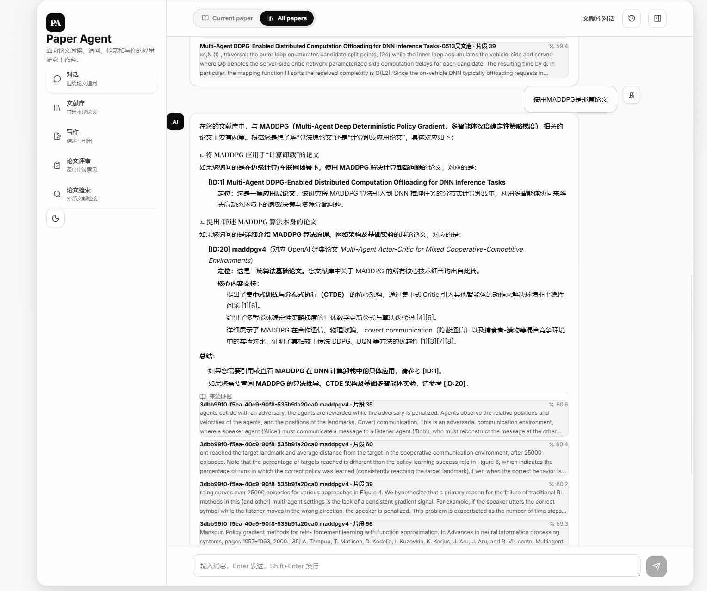
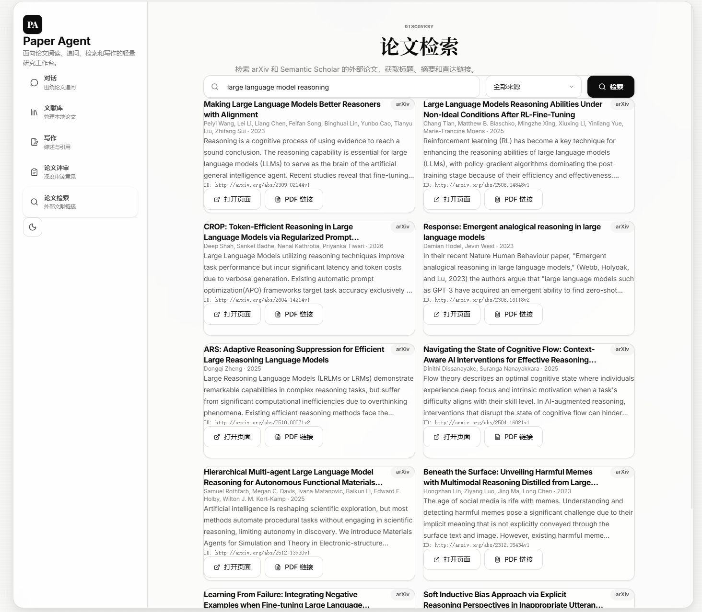

# Paper Agent

基于 Spring Boot + React + PostgreSQL/pgvector 的科研文献智能助手。支持 PDF 上传解析、文献库管理、进阶 RAG 问答、会话记忆与上下文压缩、论文自动评审、自主综述写作和 Markdown/LaTeX 导出。

## 截图






---

## 功能概览

| 模块 | 功能 |
|------|------|
| **文献库** | PDF 上传、文本解析、标题/作者/DOI/标签/摘要/笔记管理 |
| **处理管线** | 上传 → 解析 → 分块 → 向量化 → 摘要生成 → 自动标签，每阶段状态可见 |
| **进阶 RAG** | 混合检索（向量 + 关键词）、多因子重排序、父块上下文扩展、元数据过滤、答案溯源与校验 |
| **会话系统** | 对话按论文或文献库分组，支持创建、保存、恢复，消息持久化 |
| **会话记忆闭环** | 写入 → 去重/更新 → 召回 → 注入上下文 → 影响回答 → 调试面板，完整闭环 |
| **记忆语义向量化** | 长期记忆自动生成 embedding，支持向量语义召回跨 session 相似记忆 |
| **上下文压缩与 Token 预算** | 三层分级压缩 + 检索前 query 增强 + 检索后 evidence 压缩 + 显式 token 预算分配 |
| **记忆安全门控** | 8 种记忆类型 + 敏感信息过滤（API key/邮箱/手机号）+ 低价值过滤 + reason 字段 |
| **外部检索** | 对接 arXiv、Semantic Scholar、PubMed、DBLP，支持 URL/DOI 导入 |
| **论文评审** | 按模板逐节深度审读，带原文引用，支持追问 |
| **自主综述写作** | 6 阶段编排：选题分析 → 文献检索 → 导入 → 大纲 → 草稿 → 自审终稿，每阶段需人工确认 |
| **写作工作台** | 基于本地文献生成综述大纲/草稿/参考文献，支持引用溯源 |
| **导出** | GB/T 7714、APA、IEEE 引用格式，导出 Markdown / LaTeX |

---

## 技术栈

### 后端

| 组件 | 版本 / 说明 |
|------|------------|
| Java | 21 |
| Spring Boot | 4.1.0 |
| Spring AI | 2.0.0（OpenAI 兼容接口 → DashScope） |
| PostgreSQL | 16 + pgvector 扩展 |
| PDF 解析 | Apache PDFBox |
| 数据库访问 | Spring Data JPA + JDBC |
| 响应式流 | Project Reactor（SSE 流式输出） |

### 前端

| 组件 | 版本 / 说明 |
|------|------------|
| React | 18 + TypeScript |
| 构建工具 | Vite |
| 状态管理 | Zustand |
| 样式 | Tailwind CSS |
| 图标 | lucide-react |

---

## 项目结构

```text
paper-agent-backend/               Spring Boot 后端
├── src/main/java/com/paperagent/
│   ├── PaperAgentApplication.java     入口
│   ├── config/
│   │   ├── AiConfig.java              ChatClient Bean 配置
│   │   ├── VectorStoreConfig.java     向量存储配置
│   │   ├── WebConfig.java             跨域配置
│   │   ├── AsyncConfig.java           异步任务配置
│   │   └── AutonomousWritingToolConfig.java  自主写作工具注册
│   ├── controller/
│   │   ├── ChatController.java        对话控制器（流式/非流式 RAG）
│   │   ├── PaperController.java       文献 CRUD
│   │   ├── SearchController.java      语义检索
│   │   ├── DiscoveryController.java   外部论文检索
│   │   ├── WritingController.java     写作工作台
│   │   ├── AutonomousWritingController.java  自主写作（6 阶段编排）
│   │   └── ReviewController.java      论文评审
│   ├── service/
│   │   ├── ChatService.java           RAG 问答（混合检索 + 答案校验）
│   │   ├── ChatSessionService.java     会话管理 + 上下文压缩存取
│   │   ├── ConversationMemoryService.java  会话记忆提取与持久化
│   │   ├── EvidenceSearchService.java  混合检索引擎（向量 + 关键词 + 重排序）
│   │   ├── EmbeddingService.java      文本向量化
│   │   ├── PaperService.java          文献处理管线
│   │   ├── PdfParserService.java      PDF 解析与分块
│   │   ├── DiscoveryService.java      多源外部检索
│   │   ├── WritingService.java        写作生成（大纲/草稿）
│   │   ├── WritingOrchestratorService.java  写作编排（证据收集 + 引用格式化）
│   │   ├── AutonomousWritingService.java   自主写作 6 阶段编排
│   │   ├── ReviewService.java         论文逐节评审
│   │   ├── TemplateService.java       评审模板管理
│   │   ├── CitationService.java       引用格式化（GB/T 7714/APA/IEEE）
│   │   ├── ExportService.java         Markdown/LaTeX 导出
│   │   ├── ArxivClient.java           arXiv API 客户端
│   │   ├── SemanticScholarClient.java  Semantic Scholar API
│   │   ├── PubmedClient.java          PubMed API
│   │   └── DblpClient.java            DBLP API
│   ├── entity/                         JPA 实体
│   ├── dto/                            数据传输对象
│   └── repository/                     Spring Data 仓库
├── src/main/resources/
│   ├── schema.sql                     数据库 DDL（含向量索引）
│   └── application-*.yml              环境配置
└── src/test/java/                     单元测试

paper-agent-frontend/                React 前端
├── src/
│   ├── api/
│   │   ├── client.ts              API 客户端（对话、检索、文献、写作）
│   │   ├── review.ts              评审 API
│   │   ├── autonomous-writing.ts  自主写作 API（SSE 事件流）
│   │   └── base.ts                API 基础 URL 工具
│   ├── components/
│   │   ├── chat/                  对话组件（ChatWindow、ChatInput、ChatMessage、EvidenceList、SearchPanel、MemoryPanel）
│   │   ├── library/               文献库组件（LibraryPage、PaperCard、PaperEditPanel、PaperUpload、PaperViewer、PaperImport）
│   │   ├── writing/               写作组件（WritingPage、WritingEditor、WritingConfigPanel、ReferenceList、ExportPanel、VersionManager、PaperPicker、WritingEvidencePanel）
│   │   ├── review/                评审组件（ReviewPage）
│   │   ├── discovery/             外部检索（DiscoveryPage）
│   │   └── layout/                布局（Layout、Sidebar、ThemeToggle）
│   ├── store/
│   │   └── chatStore.ts           Zustand 对话状态
│   └── types/
│       └── index.ts               TypeScript 类型定义
└── scripts/                       辅助脚本
```

---

## 核心设计详解

### 1. 文献处理管线

每篇上传的论文经历一条完整的异步处理管线：

```
UPLOADED → PARSING → EMBEDDING → READY
                                      ↘ ERROR（任意阶段失败）
```

- **UPLOADED**：文件已保存到 `uploads/papers/`，创建 Paper 记录
- **PARSING**：PDFBox 提取全文文本，按段落智能分块（相邻块有适度重叠），同时自动提取标题和页数
- **EMBEDDING**：每个文本块通过 DashScope Embedding API（`text-embedding-v4`）生成 1024 维向量，写入 `paper_chunks` 表
- **READY**：向量化完成后，调用大模型生成结构化中文摘要（研究背景 / 研究方法 / 主要发现 / 结论与贡献），并基于关键词匹配 + 词频分析自动生成 3–4 个标签

处理管线中的核心错误处理：任一步骤失败会将论文标记为 `ERROR`，不会影响其他论文的处理。

### 2. 进阶 RAG —— 混合检索与多因子重排序

系统的 RAG 管线设计目标是 **高召回 + 高精度**，由 `EvidenceSearchService` 和 `ChatService` 协同完成。

#### 2.1 检索层：双路召回 + 父块扩展

```
用户问题 → Embedding 向量化
              ├─→ 向量检索（pgvector cosine 距离，HNSW 索引）
              └─→ 关键词检索（PostgreSQL websearch_to_tsquery + ts_rank_cd）
              ↓
         合并去重 → 多因子重排序 → 取 Top-K → 父块上下文扩展
```

**向量检索**：利用 pgvector 的 `<=>` 余弦距离算子 + HNSW 近似最近邻索引，在 O(log N) 时间内检索语义最相关的文本块。

**关键词检索**：利用 PostgreSQL 全文搜索（`tsvector` / `tsquery`），对专业术语、缩写、数字等向量检索可能遗漏的内容进行精确匹配。

**候选召回放大**：两种检索方式各取 `limit × 5`（至少 25 条）候选结果，扩大召回池供后续重排序。

#### 2.2 重排序层：多因子融合打分

`CandidateScore` 内部类实现了一个精巧的 **无模型重排序**（无需额外 cross-encoder 开销）：

```
finalScore = retrievalScore × 0.65 + lexicalScore × 0.35 + hybridBoost + keywordBoost
```

其中：

| 因子 | 权重 | 说明 |
|------|------|------|
| `retrievalScore` | 0.65 | max(向量相似度, 关键词相似度) |
| `lexicalScore` | 0.35 | 查询精确包含（1.0）+ 词项匹配率 |
| `hybridBoost` | +0.10 | 同片段被向量和关键词同时命中（"交集增强"） |
| `keywordBoost` | +0.15 | 被关键词检索命中（术语精确匹配加分） |

Lexical Score 的计算：先检查完整查询字符串是否包含在片段中（是则 +1.0），再统计查询中的有效词项（≥2 字符）在片段中的匹配率并累加。

#### 2.3 父块上下文扩展

每个命中的片段会向前后各扩展 1 个相邻块（`PARENT_CONTEXT_RADIUS = 1`），拼接后作为完整上下文返回给大模型。这解决了"片段截断导致信息不完整"的经典 RAG 问题。

#### 2.4 生成层：溯源 RAG + 答案校验

**可溯源 Prompt 架构**（[ChatService.java:278](paper-agent-backend/src/main/java/com/paperagent/service/ChatService.java#L278)）：

```
## 用户的文献库          ← 文献库级 meta 信息（论文数量、标签分布、论文列表）
## 语义搜索匹配到的内容片段  ← 具体的证据片段，带编号 [1][2][3]...
## 指引                   ← 严格的引用规则
历史对话                  ← 压缩后的上下文
用户问题                  ← 当前问题
```

该架构区分了"文献库管理类问题"（使用文献库概况回答）和"论文内容类问题"（使用证据片段回答），防止两类问题的检索结果互相干扰。

**两阶段答案校验**（[ChatService.java:322](paper-agent-backend/src/main/java/com/paperagent/service/ChatService.java#L322) `verifyAnswerAgainstEvidence`）：

1. 第一轮：LLM 基于证据生成回答草稿
2. 第二轮：LLM 作为"引用校验员"，逐一核验草稿中的每个事实性断言是否被证据直接支持，移除无证据支撑的内容

这种 **生成 → 校验** 的两阶段设计显著降低了幻觉率。

### 3. 会话记忆与上下文压缩

随着对话增长，原始的"把所有历史消息塞进 prompt"方案会迅速超出 token 限制。系统实现了一套 **三层分级上下文压缩** 机制。

#### 3.1 三层压缩架构

```
┌──────────────────────────────────────┐
│  Layer 1: Recent Messages (最近12轮)  │  ← 完整保留，详细上下文
├──────────────────────────────────────┤
│  Layer 2: Rolling Summary (滚动摘要)  │  ← 旧历史压缩为一段摘要（≤4000 字符）
├──────────────────────────────────────┤
│  Layer 3: State JSON (结构化状态)     │  ← 提取目标、决策、问题、偏好
└──────────────────────────────────────┘
```

- **近期窗口**（`HISTORY_LIMIT = 12`）：最近 12 轮对话按原始内容保留，提供最丰富的局部上下文
- **滚动摘要**（`rollingSummary` 列，TEXT）：将较早的对话压缩为大模型生成的一段连贯摘要
- **结构化状态**（`stateJson` 列，TEXT）：从对话中提取的 Schema v1 结构：
  ```json
  {
    "schemaVersion": 1,
    "currentGoal": "当前活跃目标",
    "confirmedDecisions": ["用户确认的决策"],
    "openQuestions": ["待解决的问题"],
    "activePaperIds": [1, 2],
    "userPreferences": ["用户的回答偏好"]
  }
  ```

#### 3.2 记忆提取与持久化

每轮对话结束后，`ConversationMemoryService.updateAfterTurn()` 调用大模型完成记忆更新：

1. **更新滚动摘要**：将上轮摘要 + 本轮对话合并重写为新的紧凑摘要
2. **更新结构化状态**：提取并更新 currentGoal、confirmedDecisions、openQuestions 等
3. **提取持久记忆**：识别值得长期记住的原子事实，按门控条件写入 `conversation_memories` 表

**记忆门控**：只有同时满足以下条件的候选才会被存储：
- `shouldRemember = true`（大模型判定值得记住）
- `importance > 0.70`（重要性阈值）
- 内容非空且有意义

**记忆分类**：
| scope | 说明 | memoryType | 说明 |
|-------|------|------------|------|
| session | 当前会话 | preference | 用户偏好 |
| project | 项目级 | decision | 确认的决策 |
| global | 全局 | project_fact | 项目事实 |
| paper | 论文级 | paper_fact | 论文事实 |
| | | workflow_rule | 工作流规则 |

**容错降级**：如果大模型的结构化 JSON 解析失败，系统自动降级为简单的"滚动追加"模式（`appendTurnToRollingSummary`），将每轮对话截断后追加到摘要末尾，保证可用性。

#### 3.3 Prompt 拼接策略

在构建发送给大模型的 prompt 时（[ChatService.java:399](paper-agent-backend/src/main/java/com/paperagent/service/ChatService.java#L399) `appendConversationContext`）：

```
## Conversation Memory
Rolling summary:           ← 压缩后的历史摘要
  ...
Structured session state:  ← JSON 格式的结构化状态
  ...
Recent conversation window: ← 最近 12 轮原始对话
  user：...
  assistant：...
```

这种分层设计在效果与效率之间取得了平衡：近期对话保留细节，远期对话保留精华，结构化状态确保关键信息不丢失。

### 4. 自主综述写作 —— 6 阶段编排

`AutonomousWritingService` 实现了一个人工在环（human-in-the-loop）的 6 阶段写作编排：

```
Phase 1: 选题分析      → AI 分析主题，输出子主题 + 关键词 + 推荐检索源
         ↓ 用户确认
Phase 2: 文献检索      → AI 使用 Tool Calling 自动检索多个学术源
         ↓ 用户确认选择
Phase 3: 导入论文      → 批量下载、解析、向量化选中的论文
         ↓ 自动进行
Phase 4: 大纲生成      → 基于已导入论文生成结构化大纲
         ↓ 用户确认/修改大纲
Phase 5: 草稿生成      → 基于大纲和论文证据生成全文草稿
         ↓ 自动进行
Phase 6: 自审终稿      → AI 审校（逻辑一致性、证据支撑、主题覆盖、事实准确性）
         ↓ 输出终稿
```

每个阶段通过 SSE 流式推送进度事件（[AutonomousWritingPhaseEvent](paper-agent-backend/src/main/java/com/paperagent/dto/AutonomousWritingPhaseEvent.java)），前端实时展示当前阶段和进度。阶段间的确认通过 `/api/writing/autonomous/confirm` 接口驱动。

Phase 2 使用了 **Spring AI Tool Calling** 机制：将 `searchPapers` 和 `finishSearch` 两个 Tool 注册给大模型，大模型自主决定检索策略、选择检索源、判断检索是否充分。

### 5. 论文评审 —— 逐节深度审读

`ReviewService` 实现了结构化的论文评审流程：

1. **章节识别**：从论文全文中自动识别章节标题（支持中英文常见学术章节名，如 Abstract、引言、方法、实验等），同时识别参考文献/致谢/附录等终止边界
2. **邻块去重拼接**：通过 suffix-prefix overlap 算法（最小匹配 12 字符）检测并去除相邻 chunk 之间的重复内容，重建完整文本
3. **逐节评审**：按章节顺序逐一评审，每节评审时提供：
   - 当前章节原文（截断至 5000 字符）
   - 前面章节的评审摘要（截断至 2400 字符）
   - 评审模板要求
4. **证据引用**：每个优点或问题必须引用原文（格式：`【原文：...】`），信息不足时必须写 `（当前章节文本无法判断）`
5. **总结性评审**：汇总所有逐节评审，提炼主要优点、主要问题、修改建议、总体结论
6. **追问机制**：评审完成后可继续追问，系统基于已完成的评审内容回答

### 6. 写作工作台 —— 证据驱动的文献综述

`WritingOrchestratorService` 编排写作流程：

```
论文选择 → 证据检索 → 去重排序 → 引用格式化 → 大纲/草稿生成 → 导出
```

- **证据采集**（`collectEvidence`）：对选定的每篇论文分别做语义检索，收集 Top-K 证据片段，按相似度排序后去重
- **引用过滤**（`papersForReferences`）：只输出真正在证据中被引用的论文的参考文献，避免"虚假引用"
- **证据锚定**：生成提示词要求每个重要主张必须附带 `[1]`、`[2]` 等来源标记
- **导出**：支持 Markdown 和 LaTeX 双格式，参考文献按 GB/T 7714 / APA / IEEE 格式化

### 7. 外部学术检索

`DiscoveryService` 聚合四个学术数据源：

| 源 | 特点 |
|----|------|
| arXiv | 物理、数学、CS 预印本，支持 PDF 直接下载 |
| Semantic Scholar | 覆盖面广，提供结构化元数据 |
| PubMed | 生物医学权威数据库 |
| DBLP | 计算机科学文献库 |

检索结果可直接导入文献库（通过 URL 或 DOI 自动下载 PDF、解析、向量化）。

### 8. 数据存储设计

```
┌─────────────┐     ┌──────────────────┐     ┌──────────────────────────┐
│   papers    │────→│   paper_chunks    │     │     chat_sessions        │
│             │     │   + embedding     │     │   + rolling_summary      │
│  标题/作者   │     │   + HNSW 索引     │     │   + state_json           │
│  DOI/标签    │     │   + FTS 索引      │     │                          │
└─────────────┘     └──────────────────┘     └──────────┬───────────────┘
                                                        │
                                             ┌──────────┴───────────────┐
                                             │                          │
                                      ┌──────┴──────┐    ┌─────────────┴──────────────┐
                                      │chat_messages│    │  conversation_memories      │
                                      │+ evidence   │    │  scope / type / importance  │
                                      └─────────────┘    │  confidence / reason        │
                                                         │  embedding + HNSW 索引      │
                                                         └────────────────────────────┘
```

- **pgvector HNSW 索引**：`paper_chunks.embedding` 和 `conversation_memories.embedding` 均建立 `vector_cosine_ops` HNSW 索引
- **全文搜索 GIN 索引**：`paper_chunks.content` 上的 `tsvector` GIN 索引支持 PostgreSQL 全文搜索
- **外键级联**：`chat_sessions`、`chat_messages`、`paper_chunks`、`conversation_memories` 均设置外键约束和级联删除

### 9. 记忆闭环 —— 完整数据流

系统实现了从"写入记忆"到"影响回答"的完整闭环：

```
每轮对话
  │
  ├─→ [写] ConversationMemoryService.updateAfterTurn()
  │      LLM 分析对话 → 更新 rollingSummary + stateJson
  │      → 提取 memoryCandidates → 门控过滤 → 去重 → 写入 conversation_memories
  │      → 异步生成 embedding（向量化）
  │
  ├─→ [读] ChatController.buildConversationContext()
  │      从 chat_sessions 读取 rollingSummary + stateJson + recentMessages
  │      从 conversation_memories 召回长期记忆（importance × 0.4 + confidence × 0.3 + recency × 0.3 + queryBoost × 0.15）
  │      → 组装 ConversationContext
  │
  ├─→ [压缩] ChatService 预处理链
  │      enhanceQuery()：用 stateJson + 长期记忆扩充检索 query
  │      compressEvidence()：检索结果逐句匹配 query 关键词 → 只保留相关句子
  │      compressContext()：长期记忆按 query 关键词过滤 → 去掉无关记忆
  │
  ├─→ [注入] ChatService.buildTraceablePrompt()
  │      TokenBudget 分配预算 → 拼接 system prompt + evidence + context + history + question
  │
  └─→ [调试] GET /api/chat/sessions/{id}/memory
         前端 MemoryPanel 展示完整记忆状态 + 单条删除
```

#### 9.1 记忆召回算法

每条长期记忆的召回分数：

```
score = importance × 0.4 + confidence × 0.3 + recency × 0.3 + queryBoost × 0.15

recency = e^(-hoursSince / 34.7)   ← 半衰期 ~24 小时
queryBoost = keywordOverlap(query, content)   ← 查询词项在记忆内容中的匹配率
```

召回后按分数降序排列，并通过 Jaccard 相似度（阈值 0.55）去重，避免返回语义重复的记忆。

#### 9.2 记忆去重与更新

写入新记忆前，在已有记忆中搜索同 `memoryType` 且 Jaccard 词集相似度 ≥ 55% 的条目：
- **有匹配** → 更新该条目的内容、取 max(importance)、取 max(confidence)、刷新 reason
- **无匹配** → 新建条目

这避免了"用户偏好中文回答"被反复保存为多条记录的问题。

---

### 10. Memory Write Gate v2 —— 安全门控

记忆写入前经过三道门控：

#### 10.1 大模型语义门控（Prompt 层）

模型被要求严格按以下标准判断：

| 条件 | 说明 |
|------|------|
| **8 种记忆类型** | `user_preference` / `confirmed_decision` / `project_goal` / `paper_fact` / `workflow_rule` / `open_question` / `research_topic` / `methodology_choice` |
| **importance 评分指南** | 0.9-1.0：用户明确声明的偏好/决策/核心目标；0.7-0.8：可复用的上下文/工作流模式；<0.5：不写 |
| **confidence 评分指南** | 0.9-1.0：用户明确说出；0.7-0.8：对话中明确暗示；<0.5：不写（太不确定） |
| **禁止记忆** | 问候/感谢/闲聊、已完成的一次性任务、模型幻觉/猜测、RAG 证据的复述 |
| **reason 字段** | 每一条记忆必须附带一句解释"为什么值得保留" |

#### 10.2 敏感信息过滤器（代码层）

`ConversationMemoryService.containsSensitiveContent()` 拒绝包含以下内容的记忆：

- API key 模式（`key:` / `key=` / `key is`）
- JWT token（`eyJ...`）
- 邮箱地址
- 手机号（中国 + 国际）
- 身份证号
- 明文密码关键词

#### 10.3 低价值过滤器（代码层）

`ConversationMemoryService.isLowValueContent()` 拒绝：

- 纯问候语（`hi` / `hello` / `ok` / `谢谢` / `好的` 等）
- 去除常见前缀后长度 < 15 字符的短文本

---

### 11. 检索增强链 —— 三级预处理

在 RAG 检索和生成之间，插入三级预处理，形成"检索增强链"：

```
用户 query
  │
  ├─→ C.13 enhanceQuery()
  │     从 stateJson 的 confirmedDecisions / currentGoal 中提取引号内的关键短语
  │     从与 query 有重叠的长期记忆中提取独有词项
  │     → 追加 ≤5 个扩展词到检索 query
  │     效果：让"这个方法效率如何"变成"这个方法效率如何 retrieval performance hybrid search"
  │
  ▼
EvidenceSearchService（混合检索，已有）
  │
  ├─→ C.14 compressEvidence()
  │     逐句拆分 evidence chunk → 检查是否含 query 关键词
  │     保留匹配句子，丢弃无关句子
  │     全部无匹配时 fallback：保留头尾各 2 句 + 省略标记 "..."
  │     效果：3 个 chunk 从 ~3000 字符压缩到 ~800 字符
  │
  ▼
  ├─→ B.8 compressContext()
  │     长期记忆按 query 关键词匹配
  │     有重叠 → 保留；无重叠 → 丢弃
  │     过滤后为空时保留 top 50% 防信息丢失
  │     额外保留 2 条非匹配记忆维持多样性
  │
  ▼
LLM 生成
```

这三个步骤全部基于关键词匹配，**不增加额外 LLM 调用**，延迟为零。

---

### 12. Token Budget 管理

`ChatService.TokenBudget` 实现显式的 context window 预算分配（估算公式：token ≈ chars / 3）：

```
总预算：~8000 tokens（模型 128k 上下文中保持精简）

┌──────────────────────────┬─────────┬──────────────────────────────┐
│ 段                      │ 预算    │ 溢出策略                      │
├──────────────────────────┼─────────┼──────────────────────────────┤
│ System prompt + 指引     │ 400     │ 固定，不裁剪                  │
│ 文献库概况 (library)     │ 600     │ head(60%) + tail(40%) 截断   │
│ Evidence 证据片段        │ 2000    │ head(60%) + tail(40%) 截断   │
│ Rolling summary + state  │ —       │ 不裁剪（已压缩）             │
│ 长期记忆                 │ 1000    │ head(60%) + tail(40%) 截断   │
│ 近期对话                 │ 1500    │ head(60%) + tail(40%) 截断   │
│ 用户问题                 │ 剩余    │ 完整保留                     │
└──────────────────────────┴─────────┴──────────────────────────────┘
```

**截断策略**：当内容超出预算时，保留前 60% + 后 40%，中间替换为 `... [truncated N chars] ...`。这种方式保留了开头（通常是最相关上下文）和结尾（通常是最近事实），牺牲了中间过渡部分。

每次构建 prompt 后输出 debug 日志记录各段实际 token 消耗，便于调优。

---

### 13. Memory Embedding —— 语义向量召回

长期记忆在写入后异步生成 1024 维 embedding 向量，存入 `conversation_memories.embedding` 列（带 HNSW 索引），支持跨 session 的语义级记忆召回。

#### 13.1 架构

```
记忆写入
  │
  └─→ Thread.startVirtualThread()   ← 异步，不阻塞主流程
        └─→ EmbeddingService.embedMemoryContent(id, content)
              └─→ embeddingModel.embed(content)
                    └─→ UPDATE conversation_memories SET embedding = ?::vector

记忆召回（语义）
  │
  └─→ ConversationMemoryService.recallByVector(query, scope, limit)
        └─→ EmbeddingService.searchMemoriesByVector(query, scope, limit)
              └─→ SELECT id, 1 - (embedding <=> ?::vector) AS similarity
                    FROM conversation_memories
                    WHERE embedding IS NOT NULL
                    ORDER BY embedding <=> ?::vector
                    LIMIT ?
```

#### 13.2 向量相似度搜索 SQL

```sql
SELECT id, 1 - (embedding <=> ?::vector) AS similarity
FROM conversation_memories
WHERE embedding IS NOT NULL
  AND (? IS NULL OR scope = ?)
ORDER BY embedding <=> ?::vector
LIMIT ?
```

- 使用 pgvector 的 `<=>` 余弦距离算子
- 配合 HNSW 索引，O(log N) 近似最近邻
- 支持 scope 过滤（session / project / global）

#### 13.3 与关键词召回的协同

系统同时提供两条召回路径：

| 路径 | 方法 | 适用场景 |
|------|------|----------|
| 关键词加权召回 | `recallMemories(sessionId, query)` | session 内，当前对话上下文 |
| 语义向量召回 | `recallByVector(query, scope)` | 跨 session，无关键词重叠但语义相似 |

两条路径可组合使用，例如：先用向量召回跨 session 的相关记忆，再用关键词加权排序。

---

### 14. 前端记忆调试面板

ChatWindow 头部新增 🧠 按钮（仅在有活跃 session 时显示），点击打开 `MemoryPanel`：

```
┌─ SESSION MEMORY ─────────────────────────── X ─┐
│  ┌──────┐  ┌──────┐  ┌──────┐                  │
│  │  5   │  │  12  │  │ Yes  │                  │
│  │Mems  │  │Msgs  │  │Summ  │                  │
│  └──────┘  └──────┘  └──────┘                  │
│                                                  │
│  ROLLING SUMMARY                                 │
│  ┌────────────────────────────────────────┐     │
│  │ User is building a RAG pipeline...     │     │
│  │ Decided to use hybrid search...         │     │
│  └────────────────────────────────────────┘     │
│                                                  │
│  ▸ SESSION STATE (可折叠)                       │
│    Goal: improve retrieval performance           │
│    Decisions: use hybrid search                  │
│    Preferences: concise Chinese answers          │
│    Active Papers: 1, 2                           │
│                                                  │
│  LONG-TERM MEMORIES (5)                          │
│  ┌──────────────────────────────────────────┐   │
│  │ ✨ 偏好       session              🗑️    │   │
│  │ User prefers concise Chinese answers     │   │
│  │ I ████████ 85%   C ████████ 90%         │   │
│  └──────────────────────────────────────────┘   │
│  ┌──────────────────────────────────────────┐   │
│  │ 🎯 目标       project              🗑️    │   │
│  │ Build a RAG-based academic assistant     │   │
│  │ I ████████ 95%   C ████████ 95%         │   │
│  └──────────────────────────────────────────┘   │
│  ...                                             │
└──────────────────────────────────────────────────┘
```

每条记忆卡片包含：
- **类型图标 + 中文标签**（8 种记忆类型各有对应图标）
- **scope 标签**（session / project / global / paper）
- **importance + confidence 进度条**（颜色编码：≥80% 绿 / ≥60% 黄 / 其余灰）
- **🗑️ 删除按钮**：点击调 `DELETE /sessions/{id}/memory/{memoryId}` 并自动刷新

---

## 快速开始

### 1. 环境要求

- **Java 21+**：确保 `JAVA_HOME` 指向 Java 21
- **PostgreSQL 16 + pgvector**：需要 pgvector 扩展
- **Node.js 18+**：前端构建需要

### 2. 创建数据库

```sql
CREATE DATABASE paperagent;
```

表结构和索引由 `schema.sql` 自动管理（应用启动时执行），JPA 使用 `ddl-auto: validate` 校验映射。

### 3. 配置后端

```powershell
cd paper-agent-backend
Copy-Item src\main\resources\application-dev.example.yml src\main\resources\application-dev.yml
```

编辑 `application-dev.yml`，填入数据库连接信息和 DashScope API Key。也可通过环境变量：

```powershell
$env:DASHSCOPE_API_KEY="你的 DashScope API Key"
```

`application-dev.yml` 已在 `.gitignore` 中排除，不会提交到仓库。

### 4. 启动后端

```powershell
cd paper-agent-backend
.\mvnw.cmd spring-boot:run
```

如果 `JAVA_HOME` 默认不是 Java 21，先设置：

```powershell
$env:JAVA_HOME="C:\jdks\openlogic-openjdk-21.0.11+10-windows-x64\openlogic-openjdk-21.0.11+10-windows-x64"
```

后端运行在 `http://localhost:8080`。

### 5. 启动前端

```powershell
cd paper-agent-frontend
npm.cmd install
npm.cmd run dev
```

前端运行在 `http://localhost:5173`，`/api` 请求自动代理到 `localhost:8080`。

### 6. 验证

```powershell
# 后端
cd paper-agent-backend
.\mvnw.cmd test

# 前端
cd paper-agent-frontend
npm.cmd run build
```

---

## API 接口

### 文献库

```text
POST   /api/papers/upload                上传 PDF（multipart/form-data）
GET    /api/papers                       文献列表（支持 query/status/tag 过滤）
GET    /api/papers/{id}                  论文详情
PATCH  /api/papers/{id}                  更新元数据（标题、作者、DOI、标签、摘要、笔记）
DELETE /api/papers/{id}                  删除论文（含文件、向量、关联会话）
GET    /api/papers/tags                  标签列表
POST   /api/papers/import                从 URL/DOI 导入论文
GET    /api/papers/status/{id}           查询处理状态（轮询用）
```

### 检索

```text
POST   /api/search/semantic              语义检索（支持 paperId/tag/日期 过滤）
```

### 对话

```text
GET    /api/chat/sessions                会话列表（按 scope + paperId 过滤）
POST   /api/chat/sessions                创建会话
GET    /api/chat/sessions/{id}/messages  会话消息历史
DELETE /api/chat/sessions/{id}           删除会话（含关联消息和长期记忆）
GET    /api/chat/sessions/{id}/memory    会话记忆调试（含 rollingSummary、stateJson、长期记忆列表）
DELETE /api/chat/sessions/{id}/memory/{mid}  删除单条长期记忆
POST   /api/chat/rag                     RAG 问答（非流式，含证据溯源 + 记忆注入）
POST   /api/chat/rag/stream              RAG 问答（SSE 流式，含证据溯源 + 记忆注入）
POST   /api/chat/stream                  普通对话（SSE 流式，含记忆上下文）
POST   /api/chat                         普通对话（非流式）
```

### 外部检索

```text
GET    /api/discovery/search             外部论文检索（支持 arxiv/semantic-scholar/pubmed/dblp/all）
```

### 写作

```text
POST   /api/writing/outline              生成大纲
POST   /api/writing/draft                生成草稿
POST   /api/writing/export               导出 Markdown/LaTeX
GET    /api/writing/versions             版本列表
GET    /api/writing/versions/{id}        版本详情
POST   /api/writing/versions             保存版本
```

### 自主写作

```text
POST   /api/writing/autonomous/start     启动自主写作（SSE 事件流）
POST   /api/writing/autonomous/confirm   确认阶段并推进到下一阶段
GET    /api/writing/autonomous/sessions  会话列表
GET    /api/writing/autonomous/sessions/{id}  会话详情
POST   /api/writing/autonomous/sessions/{id}/cancel  取消会话
DELETE /api/writing/autonomous/sessions/{id}         删除会话
```

### 论文评审

```text
GET    /api/review/templates             评审模板列表
GET    /api/review/templates/{id}        模板详情
POST   /api/review/templates             上传自定义模板
DELETE /api/review/templates/{id}        删除模板
POST   /api/review/start                 启动评审（SSE 事件流）
POST   /api/review/continue              追问评审
GET    /api/review/sessions              评审会话列表
GET    /api/review/sessions/{id}         评审会话详情
DELETE /api/review/sessions/{id}         删除评审会话
```

---

## 配置参考

### DashScope 模型映射

| 用途 | 模型 |
|------|------|
| Chat / RAG / 写作 / 评审 | `qwen3-235b-a22b-thinking-2507` |
| Embedding（1024 维） | `text-embedding-v4` |

### 关键配置项

```yaml
spring:
  ai:
    openai:
      api-key: ${DASHSCOPE_API_KEY}
      base-url: https://dashscope-intl.aliyuncs.com/compatible-mode/v1
      chat:
        options:
          model: qwen3-235b-a22b-thinking-2507
      embedding:
        options:
          model: text-embedding-v4
  datasource:
    url: jdbc:postgresql://localhost:5432/paperagent
    username: paperagent
    password: ${DB_PASSWORD}
```

---

## 许可证

暂无。正式发布前请补充 `LICENSE` 文件。
